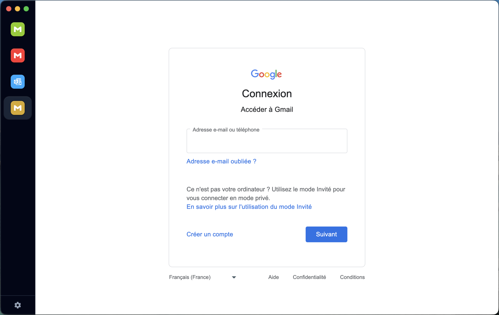
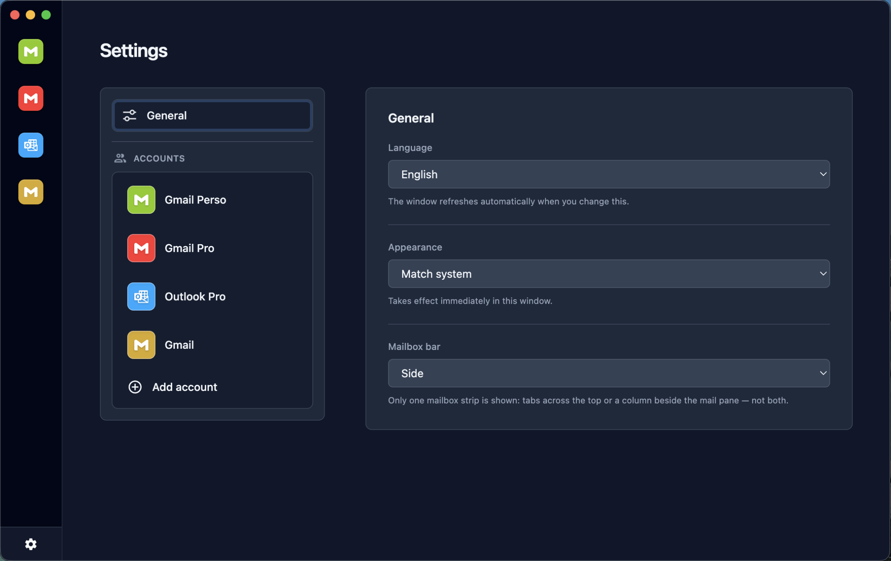

# Webmail

Desktop client for juggling **multiple webmail accounts in a single window**, built with [Electron](https://www.electronjs.org/).

The user-facing app name is **Webmail** (`productName` in [`package.json`](package.json)). The npm package name for this repository is **`webmail-app`**.

## Screenshots

Representative UI (dark shell); replace with your own captures if you publish marketing material.

| Main workspace (account tabs + webmail) | Settings |
| --- | --- |
|  |  |

## Features

- **Multiple accounts** with a sidebar switcher and **isolated** Chromium storage per `<webview>` partition.
- **Presets**: Gmail, Outlook (Microsoft 365), iCloud Mail, Yahoo Mail — plus arbitrary URLs for custom icons (Iconify ids).
- **Per-account settings** (display name, URL override, colour, delete).
- **Light / dark shell** aligned with system `prefers-color-scheme` (CDN-free: bundled Tailwind + local Iconify runtime).
- **Internationalization**: `en`, `de`, `fr`, `es` JSON packs under [`src/locales/`](src/locales/). Detection uses Electron’s **`getPreferredSystemLanguages()`** plus **`app.getLocale()`**, with **English fallback** for anything else.
- **Language override**: in **Settings → Language**, choose *system* or force a locale; preference is saved in `preferences.json` under the OS user-data folder for the app, and windows reload automatically.
- **macOS**: `hiddenInset` title bar; in **development** (`electron .`), a single **`build/icons/icon.png`** (else fallback **`build/icon.icns`**) for window + Dock — a **packaged `.app`** uses the bundle icon (`Assets.car` / `.icon`) with no runtime Dock override.

**Not shipped:** OS-level push notifications for new mail — only the heuristic Dock badge applies.

## Requirements

- [Node.js](https://nodejs.org/) **20+** (LTS recommended; see `engines` in [`package.json`](package.json))
- npm

The repository includes a committed **`package-lock.json`**. For reproducible installs in CI or on a clean machine, prefer **`npm ci`** after clone.

## Development

```bash
npm install   # runs prepare → copies Iconify + builds Tailwind into src/vendor/
npm test
npm start
```

| Path | Role |
|------|------|
| [`src/main.js`](src/main.js) | Main process |
| [`src/app.html`](src/app.html), [`src/app.js`](src/app.js) | Renderer UI |
| [`src/preload.js`](src/preload.js) | Preload bridge (IPC whitelist) |
| [`src/vendor/tailwind.css`](src/vendor/tailwind.css) | Compiled utilities (run `npm run build:css` after class changes if you skipped `prepare`) |
| [`src/vendor/iconify.min.js`](src/vendor/iconify.min.js) | Bundled Iconify loader |
| [`src/style.css`](src/style.css) | Extra injected chrome styles |

After editing Tailwind class names in HTML/JS, refresh assets with **`npm run build:css`** (or **`npm run vendor:sync`**, which also recopies Iconify).

## Building for distribution

Scripts use [electron-builder](https://www.electron.build/). Configuration lives in [`electron-builder.js`](electron-builder.js) at the repo root (not in `package.json`).

| Script | Purpose |
| --- | --- |
| **`npm run dist`** | Builds for the **current OS only** (plain `electron-builder`). |
| **`npm run dist:mac`**, **`dist:win`**, **`dist:linux`** | One platform at a time (used by CI). |
| **`npm run dist:all`** | macOS + Windows + Linux in one invocation — only practical when the host has the required toolchains (often a fully set-up macOS machine). |

Bundled branding assets live under [`build/`](build/). For macOS packaging:

- If **`build/icon.icon`** exists **and** `xcrun actool --version` reports **major ≥ 26** (Xcode 26+), it is used as **`mac.icon`** so electron-builder can compile **`Assets.car`**. On older toolchains (e.g. current GitHub `macos-latest`), **`mac.icon`** automatically falls back to **`build/icon.icns`**.
- If there is no **`build/icon.icon`** directory, **`mac.icon`** is **`build/icon.icns`**.

The **`dmg`** volume icon stays **`build/icon.icns`** (electron-builder does not inherit `.icon` for DMG artwork).

In development, [`src/main.js`](src/main.js) loads **`build/icons/icon.png`** (fallback **`build/icon.icns`** on macOS) for the window and Dock only when **`!app.isPackaged`**. Packaged builds use the app bundle icon only.

Windows builds set **`verifyUpdateCodeSignature`** to **`false`** in packager config — turn this **on** and sign installers when you ship signed releases so auto-update tooling can enforce signatures.

### Google login User-Agent tweak

After **`app.whenReady()`**, the default session attaches a **`webRequest`** listener that uses a **Firefox-style User-Agent** for **`accounts.google.com`**, to reduce “unsupported browser” behaviour in Electron mail shells (discussion context: [timche/gmail-desktop#174](https://github.com/timche/gmail-desktop/issues/174)).

External windows opened via `window.open` are only honoured for **`http:`** / **`https:`** URLs before loading in-place.

## Security notes (webview model)

Keeping **`nodeIntegration: false`** + **`contextIsolation: true`** in the renderer is intentional. Embedded mail UIs remain third-party code — treat credential hygiene like a normal browser (password manager / screen lock).

For reporting security issues, see [`SECURITY.md`](SECURITY.md).

## Releases & CI

Pushing a **git tag** runs [`.github/workflows/release.yml`](.github/workflows/release.yml): install dependencies, run **`yarn dist`** on a single macOS runner, then upload the packaged artifacts to a **[GitHub Release](https://github.com/jbdelavoix/webmail-app/releases)** for that tag. The build script passes **`--publish=never`** so `electron-builder` still builds artifacts but does not try to push to GitHub itself (no **`GH_TOKEN`** required for the build step).

Apple **notarization** / Microsoft **Authenticode** signing are not automated here; add secrets and builder options when you ship signed installers (see also **`verifyUpdateCodeSignature`** in [`electron-builder.js`](electron-builder.js)).

## Downloads

Artifacts (if published) appear on **[Releases — latest](https://github.com/jbdelavoix/webmail-app/releases/latest)** (see [`homepage`](https://github.com/jbdelavoix/webmail-app) in `package.json`).

## Testing

Automated **`node:test`** files live under [`test/`](test/) as **`*.test.js`** (e.g. [`test/i18n.test.js`](test/i18n.test.js), [`test/preferences.test.js`](test/preferences.test.js)). Run:

```bash
npm test
```

## License

**MIT** — see [`LICENSE`](LICENSE).

## Maintainer

- [jbdelavoix](https://github.com/jbdelavoix)
